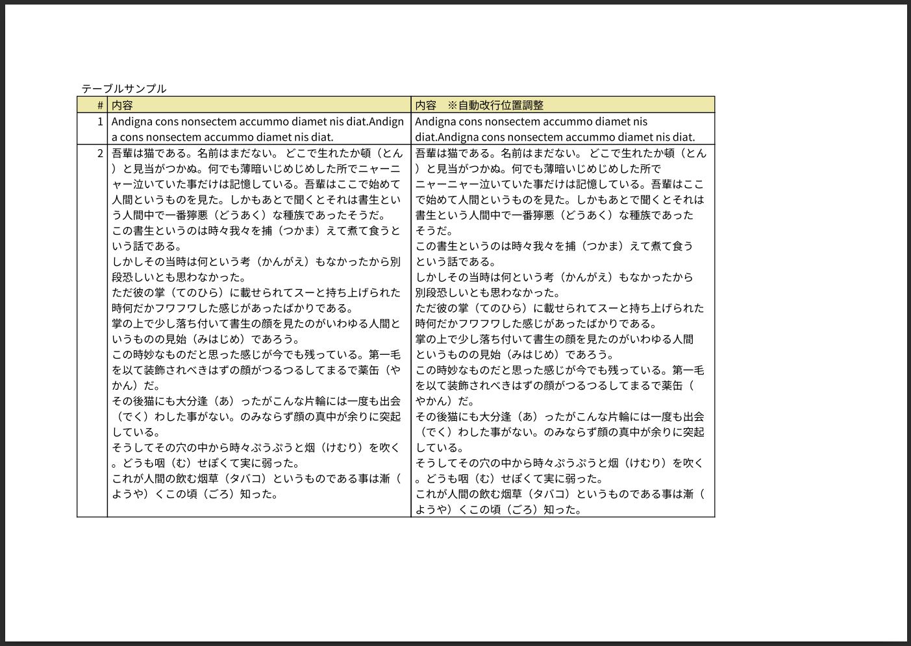

# dotnet_pdfsharp_example1

## 概要
PDFsharp を使って PDF を作成してみるサンプル

Home of PDFsharp and MigraDoc Foundation  
https://www.pdfsharp.net/  

GitHub - PDFsharp & MigraDoc 6  
https://github.com/empira/pdfsharp  
[MIT License](https://github.com/empira/pdfsharp?tab=License-1-ov-file)  

### PDFsharp
PDFsharpは、任意の .NET 言語から PDF ドキュメントを簡単に作成して処理できるオープン ソースの .NET ライブラリです。  
同じ描画ルーチンを使用して、PDF ドキュメントを作成したり、画面に描画したり、任意のプリンタに出力を送信したりできます。  

MigraDocで2バイト文字が自動改行されない問題について海外のサイトを調査してください。
※文字化けのことではありませんので留意してください。

### MigraDoc Foundation
MigraDoc Foundation は、段落、表、スタイルなどを含むオブジェクト モデルに基づいてドキュメントを簡単に作成し、PDF または RTF にレンダリングするオープン ソースの .NET ライブラリです。

### 参考
* PDFSharp MigraDoc を使ってC#でPDF生成  
  https://2ndgd.blogspot.com/2018/07/pdfsharp-migradoc-cpdf.html

## 環境

```
$ dotnet --info
.NET SDK:
 Version:           8.0.108
 Commit:            665a05cea7
 Workload version:  8.0.100-manifests.109ff937

ランタイム環境:
 OS Name:     ubuntu
 OS Version:  24.04
 OS Platform: Linux
 RID:         ubuntu.24.04-x64
```

## 詳細

```
dotnet new console
dotnet add package PDFsharp --version 6.2.0-preview-1
dotnet add package PDFsharp-MigraDoc --version 6.2.0-preview-1
```

```
dotnet run
```

## スクリーンショット


